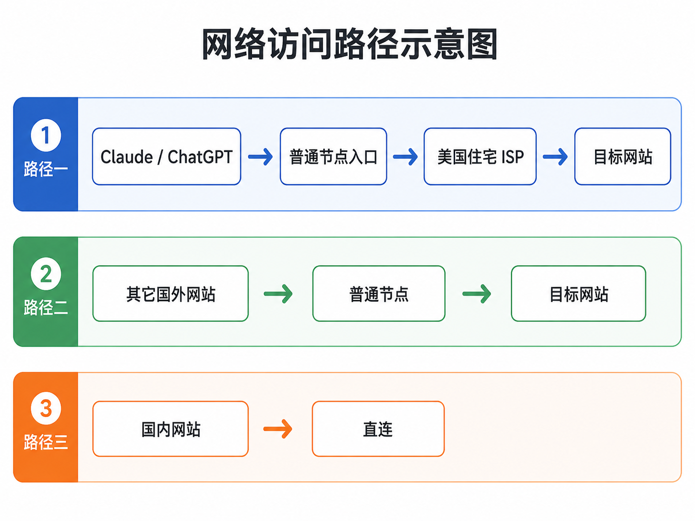
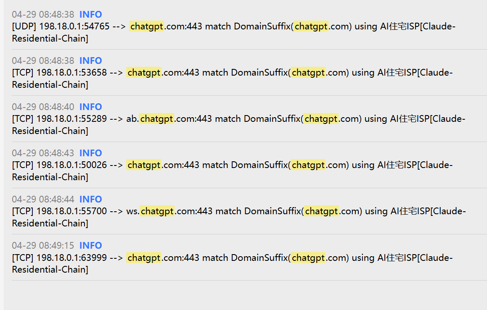
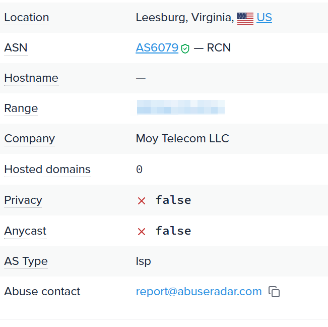

# Clash 链式代理配置

新版 Clash / Mihomo 已经支持链式代理，直接配置并不难。真正的问题是：如果所有流量都走住宅 IP，成本高，速度也容易受影响。

所以我用的是一套更省的分流方案：

- OpenAI / Anthropic / Claude / ChatGPT 走美国住宅静态 ISP。
- YouTube、Google、GitHub、Telegram 等其它国外网站走普通节点。
- 国内网站和中国 IP 直连。

下面这张图能快速说明访问路径：



## 适合谁用？

你手头有一个普通机场订阅，但节点可能不太干净，容易被 ChatGPT、Claude 这类服务拒绝。

你单独买了一个美国住宅静态 ISP 代理，希望只让 AI 服务走住宅 IP，不想让 YouTube、GitHub 这些普通流量也跟着绕路。

你还希望国内网站保持直连，省流量，也不影响速度。

如果是这种情况，这套配置会比较合适。

## 准备工作

需要准备：

- 一个可用的机场订阅，支持 Clash 即可。
- 一个住宅 ISP 代理，SOCKS5 或 HTTP 都可以。下面以 SOCKS5 为例。
- 住宅代理的地址、端口、用户名、密码。

住宅代理质量差别很大，这里只讲配置方法，不推荐具体商家。

## 找到 Clash Verge Rev 配置目录

Windows 下配置目录一般在：

```text
C:\Users\你的用户名\AppData\Roaming\io.github.clash-verge-rev.clash-verge-rev
```

比如用户名是 `Lenovo`，路径就是：

```text
C:\Users\Lenovo\AppData\Roaming\io.github.clash-verge-rev.clash-verge-rev
```

如果找不到，多半是因为 `AppData` 文件夹默认隐藏。可以这样打开：

1. 按 `Win + R`
2. 输入下面这行
3. 回车

```text
%APPDATA%\io.github.clash-verge-rev.clash-verge-rev
```

进去后打开 `profiles.yaml`，找到当前正在使用的订阅：

```yaml
current: xxxxxxxxxxxx
```

再往下找同一个 `uid` 对应的 `option`：

```yaml
option:
  script: xxxxxxxxxxxx.js
  proxies: xxxxxxxxxxxx.yaml
  groups: xxxxxxxxxxxx.yaml
  rules: xxxxxxxxxxxx.yaml
```

后面要改的四个文件，都在：

```text
C:\Users\你的用户名\AppData\Roaming\io.github.clash-verge-rev.clash-verge-rev\profiles
```

## 核心修改：不要直接改 clash-verge.yaml

很多人习惯直接改 `clash-verge.yaml`，但这个文件是 Clash Verge Rev 动态生成的。订阅一更新，它就可能被覆盖。

更稳的做法是改 `profiles` 目录里的增强文件，也就是上面看到的：

- `proxies`
- `groups`
- `rules`
- `script`

## 1. 修改 proxies 文件

打开 `proxies` 对应的 YAML 文件，在里面追加你的住宅代理。

```yaml
prepend: []
append:
  - name: "Claude-Residential-Chain"
    type: socks5
    server: 你的住宅IP
    port: 你的端口
    username: 用户名
    password: 密码
    udp: true
    dialer-proxy: "AI入口"
delete: []
```

需要改的地方：

- `name`：住宅代理的名字，后面脚本里的 `AI_PROXY` 要和它一致。
- `server`：你的住宅代理地址。
- `port`：你的住宅代理端口。
- `username` / `password`：你的住宅代理账号密码，没有就删掉。

最关键的是：

```yaml
dialer-proxy: "AI入口"
```

这表示住宅代理不是直接连接外网，而是先经过一个普通节点入口，再由那个入口去连接住宅代理。这样最终出口还是住宅 IP。

`AI入口` 这个组名会在后面的脚本里创建，这里先写上。

## 2. 清空 groups 文件

打开 `groups` 对应的 YAML 文件，改成：

```yaml
prepend: []
append: []
delete: []
```

这样做是为了避免订阅自带的分组混进来，后面统一由脚本生成分组。

## 3. 清空 rules 文件

打开 `rules` 对应的 YAML 文件，改成：

```yaml
prepend: []
append: []
delete: []
```

规则也统一交给脚本控制。

## 4. 修改 script 文件

这是最关键的一步。

为什么推荐用脚本？因为订阅节点会变。今天有 30 个节点，明天可能变成 40 个，节点名也可能变化。如果全部手动维护，订阅更新后很容易乱。

脚本的作用是：

- 自动读取当前订阅里的节点。
- 自动排除“剩余流量”“套餐到期”这类信息节点。
- 自动生成普通节点组、AI 住宅组、AI 入口组。
- 自动把 AI 服务规则放到前面。
- 国内域名和中国 IP 直连。
- 其它流量最后走普通节点。

打开 `script` 对应的 `.js` 文件，把内容替换成下面这份：

```js
function main(config, profileName) {
  const AI_PROXY = "Claude-Residential-Chain"; // 改成 proxies 文件里填写的 name
  const AI_GROUP = "AI住宅ISP";
  const ENTRY_GROUP = "AI入口";
  const NORMAL_GROUP = "普通节点";

  const aiDomains = [
    "openai.com",
    "chatgpt.com",
    "chat.openai.com",
    "oaistatic.com",
    "oaiusercontent.com",
    "openaiapi-site.azureedge.net",
    "auth0.com",
    "featureassets.org",
    "prodregistryv2.org",
    "anthropic.com",
    "claude.ai",
    "claude.com",
    "claudeusercontent.com",
  ];

  const directDomains = [
    "apple.com", "icloud.com", "icloud-content.com", "mzstatic.com",
    "126.com", "126.net", "127.net", "163.com", "qq.com", "wechat.com",
    "tencent.com", "taobao.com", "tmall.com", "alipay.com", "alicdn.com",
    "baidu.com", "bdstatic.com", "bilibili.com", "jd.com", "douyin.com",
    "amap.com", "meituan.com", "zhihu.com", "xiaomi.com",
  ];

  const isInfoNode = (name, index) => {
    if (index < 3) return true;
    return ["剩余流量", "距离下次", "套餐到期"].some((word) => name.includes(word));
  };

  config.proxies = config.proxies || [];

  const normalNodes = config.proxies
    .map((proxy, index) => ({ name: String(proxy.name || ""), index }))
    .filter(({ name, index }) => name && name !== AI_PROXY && !isInfoNode(name, index))
    .map(({ name }) => name);

  const entryNodes = normalNodes.length ? normalNodes.slice(0, 8) : ["DIRECT"];

  config["proxy-groups"] = [
    {
      name: NORMAL_GROUP,
      type: "select",
      proxies: ["自动选择", "故障转移", ...normalNodes, "DIRECT"],
    },
    {
      name: AI_GROUP,
      type: "select",
      proxies: [AI_PROXY],
    },
    {
      name: ENTRY_GROUP,
      type: "select",
      proxies: entryNodes,
    },
    {
      name: "自动选择",
      type: "url-test",
      proxies: normalNodes.length ? normalNodes : ["DIRECT"],
      url: "https://www.gstatic.com/generate_204",
      interval: 300,
    },
    {
      name: "故障转移",
      type: "fallback",
      proxies: normalNodes.length ? normalNodes : ["DIRECT"],
      url: "https://www.gstatic.com/generate_204",
      interval: 300,
    },
    {
      name: "GLOBAL",
      type: "select",
      proxies: [NORMAL_GROUP, AI_GROUP, "DIRECT"],
    },
  ];

  config.rules = [
    ...aiDomains.map((domain) => `DOMAIN-SUFFIX,${domain},${AI_GROUP}`),
    `DOMAIN,api.anthropic.com,${AI_GROUP}`,
    `DOMAIN,console.anthropic.com,${AI_GROUP}`,
    ...directDomains.map((domain) => `DOMAIN-SUFFIX,${domain},DIRECT`),
    "DOMAIN-SUFFIX,local,DIRECT",
    "IP-CIDR,127.0.0.0/8,DIRECT,no-resolve",
    "IP-CIDR,172.16.0.0/12,DIRECT,no-resolve",
    "IP-CIDR,192.168.0.0/16,DIRECT,no-resolve",
    "IP-CIDR,10.0.0.0/8,DIRECT,no-resolve",
    "IP-CIDR,100.64.0.0/10,DIRECT,no-resolve",
    "IP-CIDR6,fe80::/10,DIRECT,no-resolve",
    "DOMAIN-SUFFIX,cn,DIRECT",
    "DOMAIN-KEYWORD,-cn,DIRECT",
    "GEOIP,CN,DIRECT",
    `MATCH,${NORMAL_GROUP}`,
  ];

  config.mode = "rule";
  return config;
}
```

## 怎么修改脚本

最常改的是三处。

### 1. 改住宅代理名字

如果你在 `proxies` 里写的名字不是 `Claude-Residential-Chain`，这里也要同步改：

```js
const AI_PROXY = "Claude-Residential-Chain";
```

### 2. 增加要走住宅 ISP 的服务

想让某个服务也走住宅 ISP，就把它的域名加到 `aiDomains` 里。

例如 Perplexity：

```js
"perplexity.ai",
```

例如 Poe：

```js
"poe.com",
```

例如 Cursor：

```js
"cursor.sh",
```

少量规则也可以手动写：

```yaml
- DOMAIN-SUFFIX,perplexity.ai,AI住宅ISP
- DOMAIN-SUFFIX,poe.com,AI住宅ISP
```

但一定要放在 `MATCH,普通节点` 前面，否则会被兜底规则提前接走。

### 3. 手动指定入口节点

脚本默认取前 8 个普通节点作为入口：

```js
const entryNodes = normalNodes.length ? normalNodes.slice(0, 8) : ["DIRECT"];
```

如果你想固定入口节点，可以改成：

```js
const entryNodes = ["香港01", "日本01", "新加坡01"];
```

节点名必须和订阅里完全一致。

## 验证配置是否生效

改完后重启 Clash Verge Rev，确认模式为规则模式。建议打开 TUN 模式，否则部分应用可能不走代理。

### 1. 看日志

打开 Clash Verge Rev 的日志页面，然后访问 `chatgpt.com` 或 `claude.ai`。

如果配置生效，会看到类似记录：

```text
chatgpt.com:443 match DomainSuffix(chatgpt.com) using AI住宅ISP[Claude-Residential-Chain]
```

重点看两处：

- `match DomainSuffix(chatgpt.com)`
- `using AI住宅ISP[Claude-Residential-Chain]`



### 2. 测试住宅 IP 属性

临时把 Clash 的 `GLOBAL` 组切到 `AI住宅ISP`，相当于全局走住宅代理，然后访问：

```text
https://ipinfo.io
```

重点看：

```text
AS Type: isp
Privacy: false
```



如果显示 `hosting` 或 `Privacy: true`，说明这个 IP 不够干净，可能会被 ChatGPT 等服务识别为机房 IP。这种情况一般只能换住宅代理。

测试完记得把 `GLOBAL` 切回普通节点或其它选项。日常不要一直全局走住宅代理。

## 日常使用流程

1. 打开 Clash Verge Rev，确认是规则模式，TUN 模式打开。
2. 在 `普通节点` 组里选一个日常用的节点，或者选 `自动选择`。
3. 在 `AI入口` 组里选一个稳定、低延迟的普通节点。
4. `AI住宅ISP` 组保持为你配置的链式代理。
5. 国内网站自动直连，不用管。
6. Claude / ChatGPT 会自动走住宅 ISP，无需手动切换。

只有临时验证住宅 IP 质量时，才把 `GLOBAL` 切到 `AI住宅ISP` 去访问 `ipinfo.io`，测完立刻切回来。
